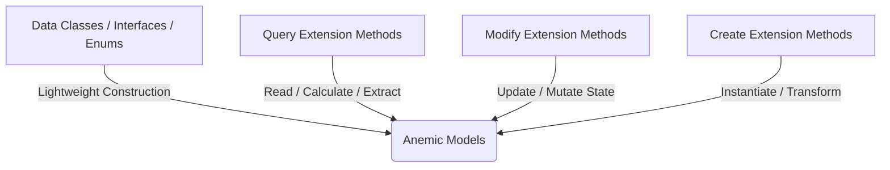

# DiGi.Core

**DiGi.Core** is the foundational core library suite for the DiGi software ecosystem. It provides the essential domain models, geometric primitives, data flow components, relation clusters, and parametrization engines used across Revit, Rhino, Grasshopper, and other engineering/architectural CAD/BIM integrations.

---

## 🏗️ Solution Architecture & Libraries

The workspace is organized into five specialized core libraries, each targeting a specific layer of the domain model and operations:

### 1. [DiGi.Core](DiGi.Core)
* **Description:** The root library containing foundational domain types and configurations.
* **Key Components:**
  * **Core Classes:** Primitives like [Address.cs](DiGi.Core/Classes/Address.cs), [Color.cs](DiGi.Core/Classes/Color.cs), [Coordinates.cs](DiGi.Core/Classes/Coordinates.cs), [Size.cs](DiGi.Core/Classes/Size.cs), [Path.cs](DiGi.Core/Classes/Path.cs), and generic wrappers like [AnyOf.cs](DiGi.Core/Classes/AnyOf.cs) and [Result types](DiGi.Core/Classes/Result).
  * **Serialization:** Dynamic JSON converters, serialized collections, and configuration parsing.
  * **Operations:** Baseline query, modify, and creation extension behaviors.

### 2. [DiGi.Core.Drawing](DiGi.Core.Drawing)
* **Description:** Drawing, styling, and basic geometric presentation utilities.
* **Key Components:**
  * [Pen.cs](DiGi.Core.Drawing/Classes/Pen.cs): Representation of colors, thicknesses, and presentation structures.
  * **Converters & Queries:** Utilities mapping raw geometric properties to visualization parameters.

### 3. [DiGi.Core.IO](DiGi.Core.IO)
* **Description:** High-performance input/output interfaces, file manipulation, and serialization helper constructs.
* **Key Components:**
  * **Delimited Data:** CSV/TSV reader/writer components and parser collections.
  * **File Watcher:** Real-time file system tracking components.
  * **Table Structures:** In-memory tabular and delimited dataset operations.
  * **Archive Containers:** Serialization archives (`Archive<T>`) for storing binary and JSON data.

### 4. [DiGi.Core.Parameter](DiGi.Core.Parameter)
* **Description:** The parametrization and metadata binding engine designed for integration with BIM environments (e.g., Revit parameters).
* **Key Components:**
  * [Parameter.cs](DiGi.Core.Parameter/Classes/Parameter.cs), [ParameterDefinition.cs](DiGi.Core.Parameter/Classes/ParameterDefinition/ParameterDefinition.cs), and [ParameterGroup.cs](DiGi.Core.Parameter/Classes/ParameterGroup.cs).
  * [ParametrizedObject.cs](DiGi.Core.Parameter/Classes/ParametrizedObject.cs), [ParametrizedGuidObject.cs](DiGi.Core.Parameter/Classes/ParametrizedGuidObject.cs), and [ParametrizedUniqueIdObject.cs](DiGi.Core.Parameter/Classes/ParametrizedUniqueIdObject.cs) for rich domain entities.
  * [GetValueSettings.cs](DiGi.Core.Parameter/Classes/GetValueSettings.cs) and [SetValueSettings.cs](DiGi.Core.Parameter/Classes/SetValueSettings.cs) controlling type coercion, conversions, and access controls.

### 5. [DiGi.Core.Relation](DiGi.Core.Relation)
* **Description:** Graph-like relationship clusters modeling multi-directional connections between domain objects.
* **Key Components:**
  * **Relations:** [OneToOneRelation.cs](DiGi.Core.Relation/Classes/OneToOneRelation.cs), [OneToManyRelation.cs](DiGi.Core.Relation/Classes/OneToManyRelation.cs), [ManyToOneRelation.cs](DiGi.Core.Relation/Classes/ManyToOneRelation.cs), and [ManyToManyRelation.cs](DiGi.Core.Relation/Classes/ManyToManyRelation.cs) (both directional and bidirectional).
  * **Relation Clusters:** Complex mapping clusters ([UniqueObjectRelationCluster.cs](DiGi.Core.Relation/Classes/UniqueObjectRelationCluster.cs), [RelationListCluster.cs](DiGi.Core.Relation/Classes/RelationListCluster.cs)) for structured topology modeling.

---

## 🎨 The DiGi.Core Architectural Pattern

To maintain a strict separation of concerns, the codebase separates **data models** (anemic schemas) from **business logic** (static extension methods). All new features must strictly follow this pattern.



### 1. Data Models (Classes, Interfaces, Enums)
* **Directory Structure:** Located under `/Classes` (Namespace: `[Project].Classes`), `/Interfaces` (Namespace: `[Project].Interfaces`), or `/Enums` (Namespace: `[Project].Enums`).
* **Scope:** Lightweight properties and basic constructors only. **No complex business logic** is allowed inside the model classes themselves.

### 2. Business Logic (Extension Methods)
All operations, business logic, and conversions are implemented as static **Extension Methods** grouped into static partial classes:
* **Query** (`/Query`): Returns values or calculations based on the object state without mutating it (e.g., translating dynamic filter groups).
* **Modify** (`/Modify`): Modifies the state or properties of the target object.
* **Create** (`/Create`): Instantiates and returns a brand-new object using inputs/offsets from the target object.

#### Pattern Example
**1. Model Class (`/Classes/PointNode.cs`)**
```csharp
namespace DiGi.Core.Classes
{
    public class PointNode
    {
        public string Name { get; set; }
        public double X { get; set; }
        public double Y { get; set; }
    }
}
```

**2. Query Operation (`/Query/DistanceToOrigin.cs`)**
```csharp
using DiGi.Core.Classes;
using System;

namespace DiGi.Core
{
    public static partial class Query
    {
        public static double DistanceToOrigin(this PointNode pointNode)
        {
            double distance = Math.Sqrt((pointNode.X * pointNode.X) + (pointNode.Y * pointNode.Y));
            return distance;
        }
    }
}
```

**3. Modify Operation (`/Modify/MoveNode.cs`)**
```csharp
using DiGi.Core.Classes;

namespace DiGi.Core
{
    public static partial class Modify
    {
        public static void MoveNode(this PointNode pointNode, double deltaX, double deltaY)
        {
            pointNode.X += deltaX;
            pointNode.Y += deltaY;
        }
    }
}
```

---

## ⚠️ Strict Coding Guidelines

All developers and AI agents must comply with these guidelines during coding tasks:

1. **English Only:** All code, namespaces, variables, and comments must be written in English.
2. **Explicit Typing Mandatory:** Always use explicit typing (e.g., `List<PointNode> pointNodes = new List<PointNode>()`). Strictly avoid the `var` keyword unless absolutely required by the compiler (e.g., anonymous types in LINQ).
3. **Variable Naming Conventions:**
   * Prefix variable/object names with their type name in camelCase (e.g., `PointNode pointNode_Base`, `PointNode pointNode_Temp`).
   * For primitive types (e.g., `double`, `string`, `int`, `bool`), type prefixes are optional (e.g., `double tolerance`, `string name` are allowed).
4. **Collection Naming:**
   * Never prefix collections with collection type names (e.g., do NOT use `listConditions` or `arrayGroups`).
   * Use the plural name of the contained object type (e.g., `FilterConditions`, `FilterGroups`).
5. **Zero Warnings:** Code must compile with zero compiler warnings or analyzer messages in Visual Studio. Adhere strictly to nullability rules and proper parameter validations.
6. **Partial Classes:** Never document the class declaration block if it is marked `partial`. Only write XML doc comments on the members contained within.

---

## 📝 XML Documentation Standards

Every public constructor, property, method, and enum value must have complete XML documentation tags to ensure IDE IntelliSense support and automatic API generation.

* **Exhaustive Coverage:** All parameters (`<param>`), return values (`<returns>`), and generic type parameters (`<typeparam>`) must be described.
* **Single Summary Rule:** Strictly write only one `<summary>` tag per member. Overwrite old comments instead of appending.
* **Formatting (No Empty Lines):** Do not leave empty lines inside documentation blocks (e.g., lines containing only `///`). To write paragraphs, wrap them in `<para>` tags:
  ```csharp
  /// <summary>
  /// Calculates the distance from the point node to the coordinate origin.
  /// <para>This calculation uses the standard Euclidean distance formula.</para>
  /// </summary>
  ```
* **Context Ingestion:** Read existing `.xml` documentation files adjacent to referenced DLL dependencies to maintain naming consistency.

---

## 🔄 Branch Synchronization & Versioning Protocol

Releases and branch merges must follow a strict, automated DevOps protocol:

### Trigger Condition
Execute the synchronization protocol **only** if the current active branch name is in the exact Semantic Versioning format: `*.*.*` (e.g., `0.8.2`). Do not trigger for branch names with prefixes or suffixes (e.g., `main`, `feature/xyz`, `v0.8.2`).

### Execution Steps
1. **Sync with Main:** Merge the active version branch into `main` and resolve any diffs.
2. **Calculate Next Version:** Increment the patch version (the third digit) by exactly `1` (e.g., `0.8.2` becomes `0.8.3`).
3. **Create New Branch:** Create and switch to a new branch off `main` with the name of the new patch version.
4. **Update [Directory.Build.props](DiGi.Core/Directory.Build.props):** Modify the version tags in `Directory.Build.props` to match the new version components:
   ```xml
   <Major>0</Major>
   <Minor>8</Minor>
   <Build>3</Build>
   ```
5. **Commit & Push:** Commit the properties update and push both the updated `main` and the new version branch to the remote repository.
